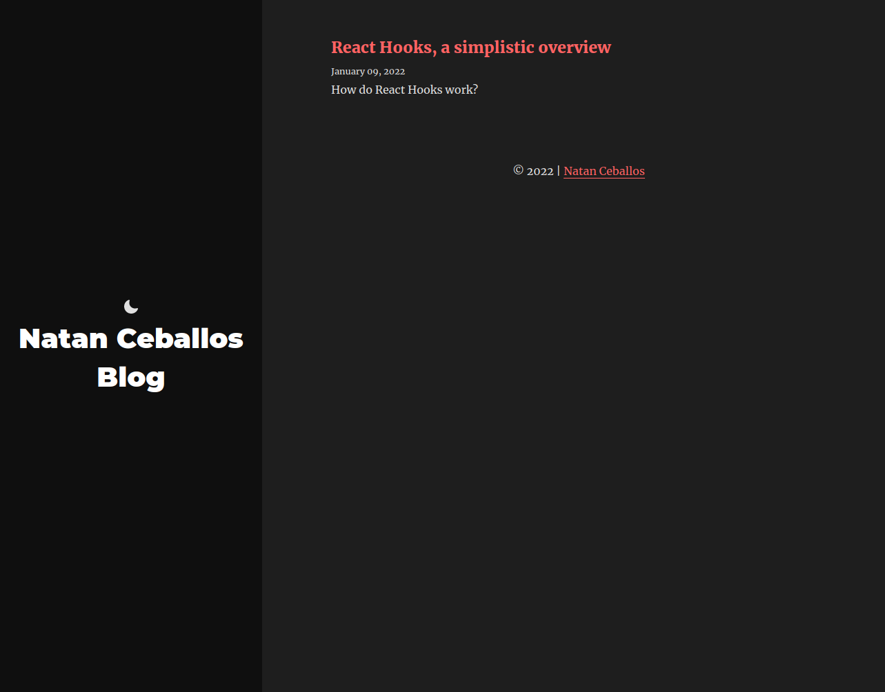

<div id="top"></div
<!-- PROJECT SHIELDS -->


<!-- PROJECT LOGO -->
<br />
<div align="center">

  <h2 align="center">Gatsby Blog</h3>

  <p align="center">
    A blog website deployed on Github Pages 
  </p>
</div>

<!-- ABOUT THE PROJECT -->

## About The Project



<p align="right">(<a href="#top">back to top</a>)</p>

<!-- USAGE EXAMPLES -->

### Built with

- [Gatsby](https://www.gatsbyjs.com/)
- [Tailwind CSS](https://tailwindcss.com/)
- [Netlify](https://app.netlify.com/)

<!-- - [Animate CSS](https://animate.style/) -->

<p align="right">(<a href="#top">back to top</a>)</p>

## App structure 

```
├── .cache
├── content
│   ├── assets
│   └── blog
├── node_modules
├── public
├── src
│   ├── assets
│   ├── components
│   ├── pages
│   ├── templates
│   └── utils
├── static
├── gatsby-browser.js
├── gatsby-config.js
├── gatsby-node.js
├── package-lock.json
├── LICENSE
├── package-lock.json
├── package.json
├── postcss.config.js
├── README.md
└── tailwind.config.js
```

<p align="right">(<a href="#top">back to top</a>)</p>

<!-- GETTING STARTED -->
## Getting Started

To get a local copy up and running follow these simple steps.

### Installation

1. Clone the repo
   ```sh
   git clone https://github.com/NatC02/blog
   ```
2. Install npm packages
   ```sh
   npm install
   ```
3. Start developing 
   ```sh
   gatsby develop
   ```
4. Build the public folder for deployment 
   ```sh
   gatsby build
   ```

## Deploy:


1. Deploy to Github Pages
   ```sh
   npm run deploy
   ```

<p align="right">(<a href="#top">back to top</a>)</p>

<!-- CONTRIBUTING -->

## Acknowledgments

### Resources

- [Tailwind Docs](https://tailwindcss.com/docs/installation)
- [Prism](https://www.npmjs.com/package/prismjs)
- [Gatsby Dark Mode Plugin](https://www.gatsbyjs.com/plugins/gatsby-plugin-dark-mode/)
- [Adding Google Analytics](https://analytics.withgoogle.com/)