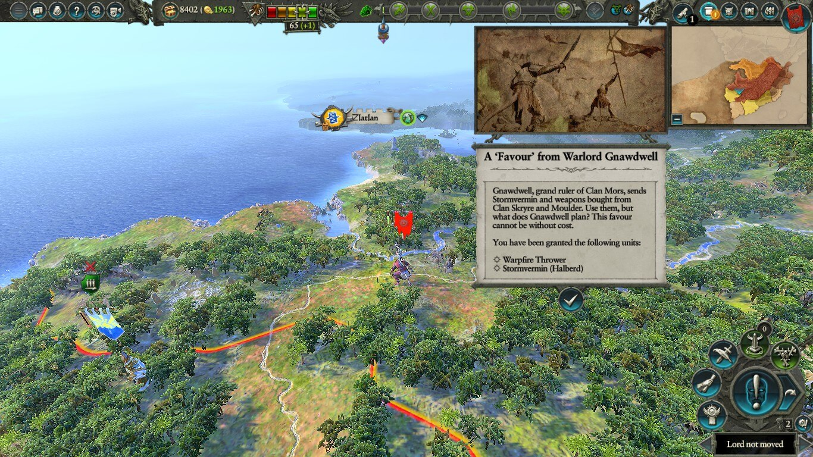
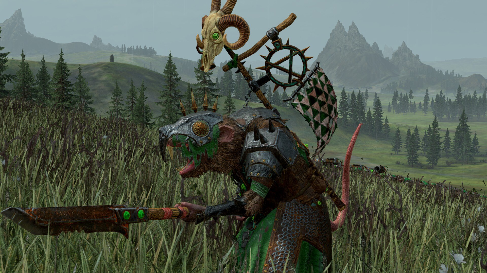
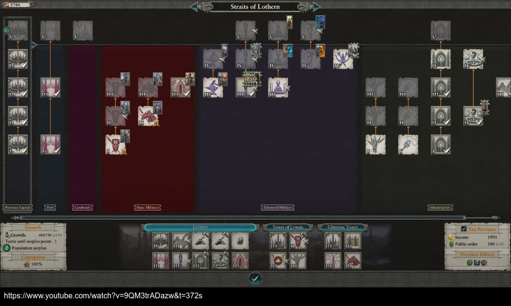
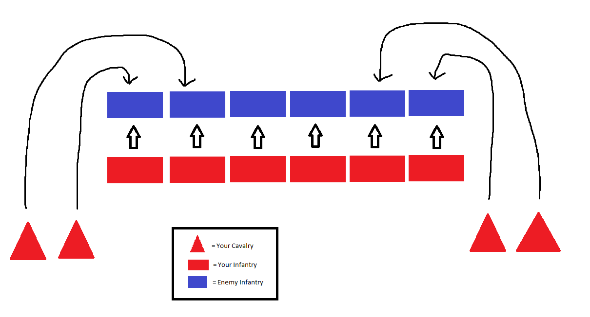
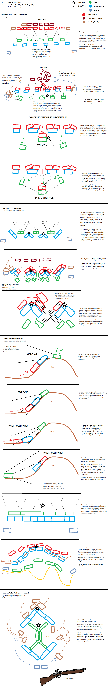

First off, Happy Ground Hog Day!

Recently I've had an itch to play a strategy game like Total War: Warhammer II (TWW2). And while typing this article, I got some screws to install my NVME back into my laptop. So I went back to playing TWW2. A new one is about to release, Total War: Warhammer III is an upcoming strategy game by Creative Assembly. The best way I can describe the game is unquenched chaos, diplomacy, and pure dopamine when things are going right. When they're not, it's because of the Lizardmen faction and their Cold-Blooded Logic. Like, I literally gave 25,834 banknotes (currency) to Lord Mazdamundi to have Military Access to his region. This guy straight up said, "Yes. Please." and then declares war on me in less than 8 turns. That's part of the "fun" of what this game has to offer. Now, after rebuilding my economy and buffing my armies, I got him surrounded and his provincial capital (he only has one anyway) is suffereing attrition losses in siege. He even tried declaring peace. Nope, fool me once shame on you, fool me twice you can't get fooled again.

Before I started to play again during my leisure time, I got involved learning the mechanics and what the heck your looking at on screen to be prepared.

<hr>



<br/>

> That UI NEEDS a tutorial (which the game has and streamlined).

Over a year ago, I jumped into Warhammer II not comprehending what I was looking at because I was so focused on trying to start a battle. The game looks GORGEOUS. Although that's part of the fun, it's not the point. There are other systems of the game I didn't even try to understand.



<br/>

> Last time I went with Skaven (above).

To me, mowing through enemy units was enough of a spectacle. But after consuming more than four hours of guides on youtube, reading some of the wiki, and even watching the entirety of the **2021 World Championships** of TWW2 to see how the pros were playing,

## I'm ready to take some notes.



<br/>

For example, the Provincial Capital (10 slots total once unlocked). The first thing I should be prioritizing early game is upgrading my Capital as every building depends on it. This includes Ports, Landmarks, Basic Military, Advanced Military, and infastructures buildings.

Then for my Settlements (4 slots), I should prioritize to have a Rank III (rank III is max rank for settlement buildings) growth building ASAP because it allows my population to grow further. Then a Rank III minor settlement building.

For the third building, I can either choose a Resource (extract resource unique to that settlement) or an income building.

<hr>

## Building Precedence list:

```md
- [x] Capital 1. Province Capital (ATLEAST tier III)
      **If no Settlements available, build Growth (Tier III)**
      #... (situational)

- [x] Settlement 1. Growth 2. Minor Settlement 3. Resource (if there is one available)
      OR 4. Income
```

<br/>

The precendence list shouldn't be followed iteratively or even strictly for that matter. As the game progresses, demolishing buildings and prioritizing certain buildings is important.

Depending on the situation-- say a settlements happens to be getting attacked, a Defense building would buy you time so your army can bash the skull of those heretics.

<hr>


## Building Skill Tree (Skaven):

```md
- What each column / color means? - 1st & 2nd Column = Buffs / Items agained after certain levels (leveling abilities) - 3rd Column = Character abilities (spells, etc) - 4th Column = Character stat increase - Blue = Research (passives for world campaign) - Red = Battle Skills (levels up base units)
```

<br/>

<hr>

## Diplomacy Options:

The game also has diplomacy options so factions can trade, sign treaties, declare war, etc...

```md
- Non-aggression pact:

  - A simple promise not to attack each other. Does not prevent raiding.

- Trade pact:

  - An option to generate income for both sides.

- Defensive alliance:

  - Promise to defend each other in case of an attack.

- Military alliance:

  - Promise to assist each other in wars to come.

- Confederation:

  - Permanent unification with the target faction.

- Vassals:

  - Target faction is subjugated by yours.

- Gift:

  - Give a payment of money to the enemy, asking nothing in return.

- Declare War:

  - begin open hostilities with a faction.

- Peace treaty:

  - End a war.
```

<br/>

## Battle Formations

I enjoy the spectacle of battle. But the cherry on top of the ice cream sunday is executing a formation you had in mind and the enemy waltzing right in. Below are some of the one's I'll try.

### The Hammer & Anvil (Alexander the Great)

<a href="https://www.reddit.com/r/totalwar/comments/2vquwn/i_need_help_understanding_formations_and_battle/">

<a/>

<br/>

If it ain't broke, don't fix it.

### Everything else

<a href="https://www.reddit.com/r/totalwar/comments/7ufew8/a_guide_to_gun_formations_in_total_war_warhammer/">

<a/>

<br/>

As I was typing this I realized that factions don't repeat between games. Although, Mortal Empires (Expansion) allows you to use previous game factions though so I kind of saved myself because I was going to scrap this article. Luckily, that's not the case because I absolutely enjoy this game. It scratches the complexity I was trying to find in a game and it's just fun as heck. I'm still learning, but I will be checking back on this post every now and again for my army battles and campaign.

I'm looking forward to progressing as the Skaven!

## Resources:

- [Total War: Warhammer 2 - Base Mechanics](https://www.youtube.com/watch?v=9QM3trADazw&t=372s)
- [Total War: Warhammer 2 - Combat Mechanics](https://www.youtube.com/watch?v=FJQGBmrLEyE)
- [Total War: Warhammer 2 World Championship 2021](https://www.youtube.com/watch?v=Xfwym1O84dQ&t=615s)
- [Total War: Warhammer 2 Wiki](https://totalwarwarhammer.fandom.com/wiki/Total_War:_Warhammer_II)
- [Total War: Warhammer Calculator](http://www.warhammercalc.com/calc/skaven/seer/ruin)
